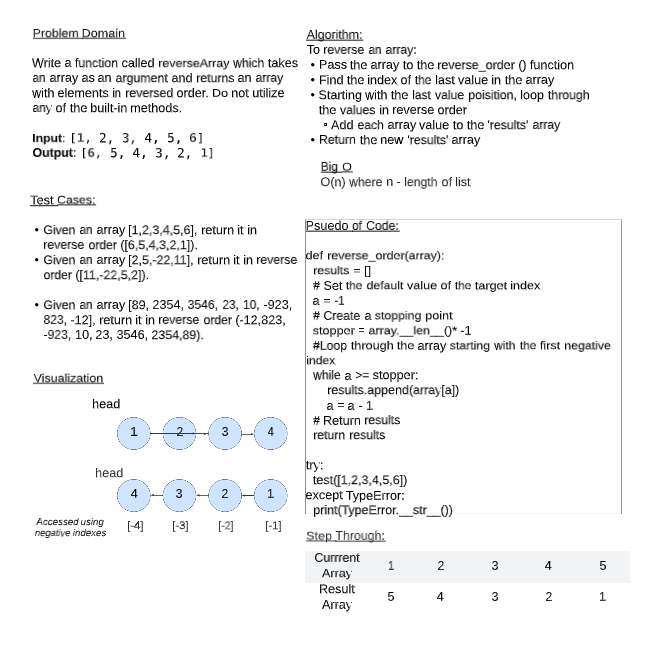

# Reverse an Array
Write a function called reverseArray which takes an array as an argument. Without utilizing any of the built-in methods available to your language, return an array with elements in reversed order.

## Whiteboard Process
)

## Approach & Efficiency
To reverse an array:
* Pass the array to the reverse_order () function
* Find the index of the last value in the array
* Starting with the last value poisition, loop through the values in reverse order
* Add each array value to the 'results' array
* Return the new 'results' array

O(n) where n - length of list 
